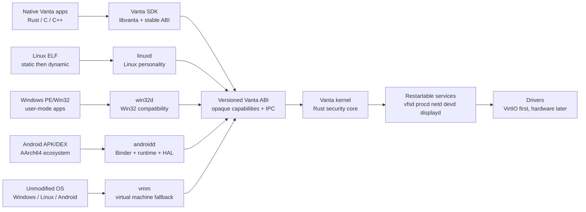

# Vanta Universal Compatibility Roadmap

Status: active sprint; Gate A complete; native platform, service, and Linux
personality foundations in progress
Date: 2026-07-30  
Scope: make Vanta a credible alternative platform for desktop, server, developer, and mobile workloads while preserving a Rust-first security boundary.

## Immediate-deliverable status — 2026-07-30

### Reality check — 2026-08-10

Vanta currently has a verified Gate A Rust/QEMU native developer OS, not a
universally compatible or production-ready operating system. The completed
gate covers UEFI/Limine boot, SMP, GPT/RedoxFS mounting, root init with
non-root developer children, native shell, real pipelines/redirection,
authorized and forbidden file operations, reboot persistence, corrupt-root
recovery, network regressions, ABI v0, and a bounded static C SDK.

The compatibility tracks remain ordered, but the current sprint is landing the
native platform foundations rather than leaving them as architecture only:
`libvanta` now has real argv/envp process setup, `vanta-services` has bounded
IPC and lifecycle behavior, and `linuxd` has static ELF metadata and an
explicit broker decision path. Kernel transport, Linux QEMU binaries, and the
later GUI/Windows/Android/VM tracks remain the next integration layers.

### ABI v0 contract update — 2026-08-01

The host ABI contract is now covered by golden vectors for syscall numbers,
feature bits, errno decoding, capability boundaries, credentials, signal
layout, and directory records. The native feature-query path and ABI v1
negotiation remain separate concerns; `GetAbiInfo` now reports the frozen v0
version and feature bits to native callers, and the GPT C hello acceptance path
validates that query. This update does not advance Track B or Track C.

Implemented and verified on `main`:

- `libvanta` bootstrap static library with C header, errno location, native file/process wrappers, and a C hello sample;
- reproducible `cargo xtask sdk` output under `target/sdk` containing `libvanta.a`, `vanta.h`, `hello.c`, and a linked `hello-vanta.elf`;
- the generated GPT image now bundles `/bin/c-hello`, and `/sbin/init` executes it during the native acceptance path;
- `vanta-linuxd` translation contract for the first static x86_64 Linux syscall subset, with deterministic unsupported-syscall and dynamic-interpreter rejection;
- `vanta-services` request/response headers with explicit service identity, request IDs, capability authority, and stable service errors;
- the kernel bootstrap heap is 2 MiB so the buffered external C image loads safely;
- native kernel release build, GPT native-init regression including the C program, legacy QEMU, VirtIO QEMU, and network QEMU regressions were last verified passing on 2026-08-07.
- kernel pipe wait states with writer/close wakeups;
- foreground-child Ctrl-C targeting and default/ignore signal dispositions;
- real native shell pipeline/redirection execution;
- RedoxFS ownership, mode, traversal, group, and umask enforcement;
- legacy, VirtIO, VirtIO-network/DNS, and GPT QEMU gates all passing.

The first external SDK syscall slice is complete as well: `libvanta` exposes
the currently implemented descriptor, directory, pipe, process, scheduling,
signal, and path-mutation calls, and `/bin/c-sdk-smoke` verifies them in GPT
QEMU. The first stdio slice is now complete too: unbuffered stream wrappers and
`/bin/c-stdio-smoke` verify create/write/reopen/read/remove behavior in GPT
QEMU. The follow-up buffered stdio bootstrap is now complete: the same sample
verifies bounded `vanta_file_t` buffering, `putc`, bulk write, `getc`, EOF,
flush, close, and removal. Environment, threading, and full `FILE`/relibc
compatibility remain open.

Gate A is complete. Post-milestone work remains:

- full environment and broader process portions of the C runtime; bounded
  directory handles, bootstrap environment lookup, bounded
  buffered stdio, unbuffered stream wrappers, the first CRT entry, and bounded
  allocator now exist, with static launch/wait/exec smoke coverage;
- connecting `vanta-linuxd` to a Linux-personality ELF loader and syscall trap broker;
- full custom signal-handler delivery and POSIX process groups/job control;
- full `FILE`/relibc stdio and process-runtime compatibility;
- copy-on-write `fork`, dynamic linking, and broader compatibility personalities.

Verification note: `cargo test --workspace` is currently not a valid Windows command for this repository because the vendored RedoxFS test dependency requires libfuse and the GNU host lacks `dlltool`. Focused workspace package tests and all available QEMU gates remain the required checks until that host-test dependency is isolated.

## 1. Executive decision

Vanta should not choose between “100% Rust everywhere” and “become Linux.” The durable strategy is:

> Rust-native kernel and security core; compatibility-maximal userland, runtimes, and guests above it.

Rust remains mandatory for the kernel, capability/object manager, memory and process isolation, IPC, security-critical services, and new Vanta system services. C, C++, Java/Kotlin, and existing upstream runtimes are acceptable where they are required for application compatibility or ecosystem reuse. This is a deliberate boundary, not a failure of the Rust goal.

Maximum compatibility is delivered by four increasingly expensive mechanisms:

1. Native Vanta applications and a stable C/POSIX-shaped SDK.
2. User-mode compatibility personalities that translate foreign ABIs to Vanta capabilities.
3. Sandboxed containers and runtime ports for ecosystems that can be rebuilt.
4. Hardware-assisted virtual machines for software whose binary, driver, or kernel assumptions are too large to reproduce.

The project must distinguish these promises:

| Promise | Meaning | Vanta strategy |
|---|---|---|
| Native | Built for Vanta and uses the Vanta ABI | Rust/C SDK, `libvanta`, package manager |
| Source-compatible | Existing source can be rebuilt with limited changes | POSIX, Linux, Win32, Android SDK layers |
| Binary-compatible | Existing binaries run without rebuilding | Linux and Win32 personalities, only by tested family |
| Guest-compatible | A full foreign OS runs unchanged | VT-x/AMD-V virtual machine with virtio devices |

Vanta must never claim the strongest promise when only a weaker one is implemented.

## 2. Compatibility canvas



The kernel must not grow a collection of foreign syscall tables. Foreign behavior belongs in personalities or a guest. The native ABI remains Vanta-owned and versioned.

## 3. Architectural target

### 3.1 Rust-mandatory core

The following remain Rust-first and are not delegated to a compatibility layer:

- boot, interrupts, CPU-local state, scheduling, and context switching;
- physical memory, virtual memory, address-space isolation, ELF loading, and safe user-pointer validation;
- capability handles, rights, generation checks, object lifetime, and authority transfer;
- native IPC, process credentials, sandboxing, quotas, and audit events;
- the native descriptor/object model and Vanta ABI dispatch;
- security-critical parts of `procd`, `vfsd`, `devd`, `netd`, and `securityd`;
- the test harness, image builder, provenance manifest, and compatibility scorecards.

### 3.2 Compatibility-permitted layers

The following may use C/C++, Java/Kotlin, or upstream code under its license and provenance rules:

- `libvanta` C runtime and static application support;
- imported libc or language runtimes, when their ABI is isolated behind Vanta syscalls;
- Win32 API implementations and graphics translation libraries;
- Android bionic, Binder-facing framework components, and ART integration;
- guest operating systems and their userspace packages;
- hardware firmware interfaces and vendor blobs, only in a separately audited driver boundary.

Every non-Rust component needs an SPDX license, source revision, patch series, build recipe, security owner, and replacement plan.

### 3.3 Services after the terminal release

```text
kernel
  ├─ capability/object manager
  ├─ VM, scheduler, IPC, interrupts
  └─ minimal device and block primitives

services
  ├─ procd       process, credentials, signals, namespaces
  ├─ vfsd        RedoxFS adapter and mount authority
  ├─ netd        network stack and socket objects
  ├─ devd        device discovery and driver lifecycle
  ├─ displayd    compositor and display protocol
  ├─ audiod      audio graph and device routing
  ├─ inputd      keyboard, mouse, touch, gamepad
  ├─ pkgd        signed packages and transactions
  └─ securityd   policy, audit, secret and identity authority

personalities
  ├─ native/libvanta
  ├─ linuxd
  ├─ win32d
  └─ androidd

fallback
  └─ vmm / guestd
```

The existing kernel-resident RedoxFS adapter is acceptable for the first usable terminal release. Its current backend boundary must remain service-shaped so extraction to `vfsd` does not change the application ABI.

## 4. Compatibility order

### Track A: native developer platform

Finish the current roadmap bundles 1–3 before broad compatibility work:

- complete pipe/process blocking and wakeup behavior;
- implement reliable `sigaction`, foreground process groups, and Ctrl-C;
- enforce RedoxFS owner/group/mode/umask checks in every traversal and mutation path;
- finish shell pipelines, redirections, exit status, and child cleanup;
- complete reboot persistence and corruption-recovery acceptance;
- keep the legacy, VirtIO, SMP, GPT, and network regressions mandatory;
- build `libvanta` and a static C hello program as the first external SDK proof.

**Gate A:** a non-root developer can log in to `/bin/vsh`, create and manipulate authorized files, run a pipeline, receive Ctrl-C, reboot, and observe the correct persistent state. A forbidden operation fails without kernel instability.

### Track B: stable Vanta platform

Before adding large personalities:

- freeze Vanta ABI v1 and publish golden encoding vectors;
- define ABI feature discovery and version negotiation;
- move process, filesystem, networking, and device authority behind service contracts;
- add service restart, crash containment, capability revocation, and audit logging;
- define package metadata, signatures, rollback, and reproducible image manifests;
- add AArch64 as a design constraint even if x86_64 remains the release target.

**Gate B:** native services can be upgraded or restarted in QEMU without changing the kernel ABI or losing unrelated processes.

### Track C: Linux compatibility

Linux is the first binary-compatibility target because it has the largest developer and server ecosystem and the clearest behavioral test sources.

Order:

1. static x86_64 ELF loader and Linux personality process metadata;
2. file descriptors, paths, `stat`, directories, pipes, signals, process identity, and memory setup;
3. `clone` subset, `fork`, `execve`, `wait4`, futexes, `epoll`, `poll`, and timers;
4. sockets, `/proc` and `/sys` compatibility views, namespaces, environment, and pseudo-terminals;
5. dynamic ELF, TLS, `PT_INTERP`, glibc ABI coverage, and shared-library loading;
6. containers with mount, PID, user, network, and resource namespaces;
7. package and distribution acceptance for Alpine/musl first, then selected Debian/glibc tools;
8. io_uring and unusual kernel interfaces only after ordinary CLI and server workloads are stable.

`linuxd` may be a privileged Rust service, but it must not silently bypass Vanta capabilities. A Linux process receives a constrained capability set and every translation has a documented error mapping.

**Gate C:** static musl `hello`, `cat`, `ls`, `sh`-level scripts, and a small server run in QEMU; dynamic binaries either pass their declared subset or fail deterministically. Unsupported syscalls are observable and do not destabilize the kernel.

Linux’s own documentation treats system calls and other user-facing interfaces as stability-sensitive, so Vanta must maintain a separate compatibility test matrix rather than casually changing behavior. See the [Linux ABI documentation](https://docs.kernel.org/admin-guide/abi.html).

### Track D: desktop platform

Build the desktop substrate before promising a Windows-like product:

- compositor and display protocol;
- keyboard, mouse, touch, clipboard, drag/drop, and accessibility objects;
- virtio-gpu first, then a carefully scoped GPU backend;
- Vulkan/OpenGL translation boundary where practical;
- audiod with a stable stream/mixer API;
- desktop shell, settings, notifications, file picker, and terminal;
- package installation, sandbox permissions, crash reporting, and rollback.

**Gate D:** a native GUI application can open windows, render, receive input, access permitted files, play audio, and survive an unrelated service restart.

### Track E: Windows user-mode compatibility

Do not begin by implementing the Windows NT kernel or Windows driver ABI. Start with a Wine-like user-mode compatibility stack:

1. PE/COFF parsing, relocations, imports/exports, TLS, exception metadata, and loader diagnostics;
2. `ntdll`-shaped process, synchronization, virtual memory, registry, and file primitives;
3. `kernel32`, `advapi32`, `ws2_32`, `user32`, `gdi32`, `ole32`, and common CRT behavior;
4. window/message loop mapping to `displayd`;
5. DirectWrite/Direct2D and selected DirectX translation through the Vanta graphics API;
6. installer, registry, font, locale, and shell integration;
7. open-source Win32 application corpus and conformance tests;
8. commercial applications only as optional, explicitly scored compatibility targets.

PE is a format and API problem, not only a loader problem: imports, exports, relocations, TLS, resources, and certificates all affect real programs. Use the [Microsoft PE format reference](https://learn.microsoft.com/en-us/windows/win32/debug/pe-format) as a format reference and keep implementation behavior clean-room and test-driven.

**Gate E:** a published set of open-source Win32 programs installs, launches, renders, reads/writes permitted files, uses networking, and exits cleanly. Unsupported APIs report the missing contract.

### Track F: Android platform compatibility

Android is not just Linux ELF. It combines AArch64, bionic, Binder, system services, ART, APK/DEX, graphics, media, sensors, permissions, and device-specific HALs.

Use two stages:

1. **Guest-first compatibility:** boot an unmodified Android guest under `vmm` with virtio storage, graphics, input, audio, and networking.
2. **Native platform compatibility:** implement the required Android runtime and services on Vanta only after the guest path proves the hardware and product assumptions.

Native Android work order:

- AArch64 ABI and ELF/DEX packaging;
- Binder-like IPC and stable service discovery;
- bionic and linker boundary;
- ART/runtime integration;
- versioned HALs for graphics, audio, camera, input, sensors, storage, and power;
- package manager, permissions, lifecycle, notifications, and background limits;
- compatibility matrix and CTS/VTS-style test execution;
- telephony, vendor integration, and certification as a separate product program.

Android’s HAL architecture deliberately separates hardware-specific implementations from framework APIs and uses versioned/binderized interfaces; Vanta should copy that separation principle, not its implementation wholesale. See the [Android HAL overview](https://source.android.com/docs/core/architecture/hal?hl=en) and [HIDL architecture](https://source.android.com/docs/core/architecture/hidl?hl=en).

**Gate F:** a minimal AArch64 Android image boots in the guest path first; a native platform target is not declared until the required framework and HAL test matrix is defined and repeatable.

### Track G: VM fallback and maximum coverage

The compatibility ceiling is a VM, not an ever-growing syscall emulator. Implement:

- VT-x/AMD-V support and a Rust VMM boundary;
- virtual CPU, memory, interrupt, and timer devices;
- virtio block, net, console, GPU, input, and sound;
- guest lifecycle, snapshots, resource limits, and capability-scoped shared folders;
- host/guest clipboard and graphics only through explicit permissions;
- Linux guest first, then Windows and Android guests where licensing and hardware allow.

The [VirtIO specification](https://docs.oasis-open.org/virtio/virtio/v1.2/virtio-v1.2.pdf) is the reference for the virtual device contracts. The guest manager must expose a Vanta capability, not unrestricted host access.

**Gate G:** a supported guest boots from a Vanta-managed image, has network/storage access through declared capabilities, can be paused/resumed, and cannot escape its resource boundary in fault-injection tests.

### Track H: macOS and proprietary ecosystems

Do not promise general macOS binary compatibility in the core roadmap. Mach-O, Objective-C/Swift runtimes, Cocoa, Metal, code signing, entitlements, and Apple hardware integration are a separate research program with legal and technical constraints. For this roadmap, macOS-oriented users are served by:

- native ports;
- POSIX and developer-tool compatibility;
- Linux/Windows application layers where the application has those builds;
- a macOS guest only on hardware and software configurations that legally support it.

## 5. Long-term phase plan

| Phase | Outcome | Exit gate |
|---|---|---|
| 0 | Architecture and ABI freeze | ABI vectors, provenance rules, task template, no new ad-hoc syscall numbers |
| 1 | Native terminal developer OS | Gate A, persistent RedoxFS, native init/shell, C hello |
| 2 | Service-oriented Vanta platform | Gate B, restartable services, package signing, capability audit |
| 3 | Linux developer/server compatibility | Gate C, musl first, glibc subset, containers |
| 4 | Desktop substrate | Gate D, GUI/input/audio/GPU baseline |
| 5 | Windows user-mode compatibility | Gate E, PE loader and open-source Win32 corpus |
| 6 | Android guest and native platform research | Gate F, guest first, HAL/runtime matrix |
| 7 | VM compatibility platform | Gate G, Linux guest then selected Windows/Android guests |
| 8 | Hardware and architecture expansion | AArch64, NVMe/AHCI, USB, real hardware matrix |
| 9 | Ecosystem scale | SDK stability, package registry, documentation, maintainers, release cadence |

This is a multi-year program. Phase completion means its gate passes; it does not mean every application in that ecosystem works.

## 6. Codex execution contract

Every implementation task generated from this roadmap must have this shape:

```text
Task ID:
Phase / gate:
Goal:
User-visible behavior:
In scope:
Out of scope:
Dependencies:
Reference behavior:
Files and modules to inspect:
API or data-contract changes:
Invariants and security conditions:
Host tests:
QEMU or guest acceptance test:
Negative/fault-injection tests:
Regression commands:
Provenance/licensing notes:
Stop condition:
Definition of done:
```

Codex must follow these rules:

1. Inspect the current repository, branch, plan, and tests before editing.
2. Preserve existing passing boot, SMP, VirtIO, persistence, and network tests unless the task explicitly changes their contract.
3. Add a failing host test or acceptance test before implementing a new behavioral contract when practical.
4. Implement one syscall family, service contract, loader feature, or device class at a time. “Implement Linux compatibility” is never an actionable task.
5. Keep foreign ABI translation outside the native kernel ABI. Do not add Linux or Win32 numbers directly to native dispatch.
6. Validate all user pointers, lengths, handles, rights, credentials, and object generations at the boundary.
7. Treat unsupported behavior as a stable error with diagnostics, never as an implicit fallback that weakens security.
8. Record upstream source revisions, licenses, patches, and test provenance in the manifest.
9. Run focused tests first, then the full relevant regression set before claiming completion.
10. Update the active plan only after the gate’s acceptance evidence exists.

## 7. First 90-day executable backlog

### 0. ABI freeze package

Create `vanta-abi` golden vectors for syscall numbers, error encoding, capability handles, rights, credentials, times, 64-bit offsets, directory records, signals, and feature discovery. Add a compatibility-version check and reject unknown mandatory features.

Status: host tests reproduce the current vectors and reject unknown mandatory
feature bits. `GetAbiInfo` is implemented at the native syscall, Rust
userland, and `libvanta` layers; the GPT C hello program is the end-to-end
feature-query proof. ABI v1 negotiation remains the next ABI follow-up.

### 1. Finish native terminal release

Complete the remaining bundles 1–3 gaps from `2026-07-21-maximizing.md`: blocking pipes/process waits, signals and foreground Ctrl-C, mode/group/umask enforcement, shell redirection/pipeline coverage, reboot persistence, and recovery behavior. Re-run all legacy, VirtIO, GPT, and relevant network regressions.

Acceptance: Gate A passes from a generated GPT image, including unauthorized-write rejection and reboot verification.

Status: complete on 2026-08-10. The generated GPT workflow passes first boot,
reboot persistence on the same image, root-to-`vanta` child demotion,
unauthorized `/etc` creation rejection, authorized `/home/vanta` file
operations, and corrupt-root recovery into the kernel shell. Legacy, VirtIO,
network, focused Rust, formatting, kernel, and userland regressions pass.

### 1a. Expand the native SDK

Status: SDK/process-context bundle complete on 2026-08-10. `libvanta`
provides bounded directory handles, bootstrap environment lookup, and static
launch/wait/exec wrappers. The generated GPT image runs directory, environment,
process-status, and exec replacement smokes alongside the existing file, stdio,
and ABI samples. Full environment propagation, broader process-runtime
behavior, and full `FILE`/relibc compatibility remain pending.

### 2. Ship the first external SDK

Expand the usable `libvanta`/CRT profile: startup, allocator, errno, file I/O,
directories, environment, process launch/wait, and static linking. The direct
syscall wrapper slice and C smoke image are complete; remaining SDK work is
environment, directories, and broader process-runtime behavior beyond the
bounded stdio bootstrap. Keep `echo`, `cat`,
`ls`, the C hello program, and the C smoke program in the RedoxFS image with
`xtask`.

Acceptance: C programs use only the documented SDK and pass file, directory,
allocation, process, pipe, exit-status, and mode tests. Status: direct-wrapper
and buffered-stdio smoke coverage pass; environment, directory runtime
wrappers, broader process behavior, and full libc/runtime coverage remain
pending.

### 3. Define service seams without extraction risk

Turn the existing RedoxFS adapter, process manager, network path, and device path into narrow request/response traits. Add crash/restart test doubles before moving code out of the kernel.

Acceptance: interfaces compile in host tests and a service failure is returned as an error rather than a kernel panic.

Status: bounded IPC frames, service lifecycle state, restart/crash containment,
capability revocation, and audit ring are implemented in `vanta-services`.
Kernel channel descriptors and a booted `procd`/service QEMU acceptance path
now prove fixed-size framed registration/discovery, blocking request/response,
restart/upgrade after crash, a real `/bin/vfsd` file request, framed audit
drain through `/bin/auditd`, filesystem persistence across reboot,
stale-authority rejection, and revocation. The generated GPT artifact now
carries deterministic image and per-root-file hashes. Broader filesystem
authority extraction, package rollback/signing, and additional service backends
remain.

### 4. Linux static personality spike

Implement a separate `linuxd` harness that loads a static x86_64 ELF and translates only process identity, memory setup, file I/O, directories, pipes, `execve`, `wait`, and exit. Add explicit unsupported-syscall reporting.

Acceptance: static musl hello, cat, and ls run in QEMU; native ABI tests remain unchanged.

Status: static x86_64 ELF metadata parsing, `PT_INTERP` rejection, syscall
translation, and an explicit broker decision contract are implemented and
host-tested in `vanta-linuxd`. Kernel trap integration and QEMU Linux samples
remain.

### 5. Compatibility scorecard and corpus

Create `tests/compat/` with per-target manifests, expected results, ABI version, image revision, and failure classification. Start with native C, static Linux, and one open-source Win32 PE sample once the loader exists.

Acceptance: every compatibility run emits machine-readable pass/fail/unsupported results and a reproducible artifact manifest.

Status: not started.

### 6. VM feasibility prototype

Do not build a full VMM yet. Define the capability and device contracts, evaluate existing Rust VMM components, and boot a minimal Linux guest only when the kernel has stable memory/device ownership primitives.

Acceptance: architecture review document plus a minimal isolated guest prototype; no guest code is merged into the native syscall path.

Status: not started.

## 8. Verification strategy

### Kernel and native platform

- unit and property tests for ABI encoding, handles, rights, lifetimes, path resolution, credentials, GPT, RedoxFS block adaptation, ELF stacks, pipes, signals, and corruption;
- QEMU boot, SMP, VirtIO, GPT, persistence, reboot, recovery, and network tests;
- fault injection for short I/O, invalid pointers, stale capabilities, malformed ELF/PE, full queues, device removal, and service crashes;
- reproducible image and source-revision manifests.

### Linux personality

- musl libc tests and selected POSIX tests;
- syscall-by-family conformance tests;
- static and dynamic loader tests;
- shell, compiler, package, networking, namespace, and signal workloads;
- deterministic unsupported behavior and no-regression native tests.

### Windows personality

- PE loader golden files;
- open-source Win32 application smoke tests;
- API contract tests for synchronization, files, registry, sockets, windows, fonts, and graphics;
- failure classification separating missing API, wrong behavior, graphics mismatch, and application bug.

### Android and guests

- boot and lifecycle tests;
- Binder/service contract tests;
- HAL version and device-matrix tests;
- CTS/VTS-style execution only after the required runtime surface exists;
- guest escape, quota, snapshot, and device-isolation tests.

## 9. Decisions that prevent dead ends

- Do not replace Vanta’s native ABI with Linux syscall numbers.
- Do not make `linuxd` a privileged escape hatch around capabilities.
- Do not implement Windows kernel-driver compatibility before user-mode Win32 coverage and a clear driver strategy.
- Do not build a native Android product before proving the guest path and defining the HAL matrix.
- Do not promise macOS binary compatibility as a release criterion.
- Do not add a graphical shell before terminal persistence, package reproducibility, and service failure behavior are reliable.
- Do not vendor large upstream projects without a pinned revision, license, patch notes, update procedure, and removal plan.
- Do not treat benchmark performance as compatibility; behavioral conformance comes first, then performance budgets.

## 10. Research and reference policy

Linux is a behavioral reference for process, memory, filesystems, ELF, terminals, sockets, and error semantics. Rust-for-Linux demonstrates how Rust can coexist with a mature C kernel, but its own documentation describes the Rust support as developing rather than a finished replacement for the whole kernel; see [Rust in Linux](https://docs.kernel.org/6.8/rust/index.html) and the [Rust kernel crate documentation](https://rust.docs.kernel.org/kernel/).

Redox remains the Rust-native architectural reference for capability-oriented handles, service boundaries, and a Rust userland. Track the relevant Redox kernel, syscall, RedoxFS, and relibc revisions in the repository manifest; use behavior and interfaces as references and preserve source licenses. The [Redox syscall interface discussion](https://gitlab.redox-os.org/redox-os/syscall/-/issues/21) is useful background for fd operations, capability-like references, and ABI stabilization.

ReactOS and Wine-like projects are references for the scale and layering of Win32 compatibility, not sources for copying undocumented or proprietary implementation details. Read the [ReactOS architecture overview](https://reactos.org/architecture/) and its [intellectual-property guideline](https://reactos.org/intellectual-property-guideline/) before creating Windows compatibility work.

Use official specifications for platform boundaries: [UEFI specifications](https://uefi.org/specifications), [VirtIO](https://docs.oasis-open.org/virtio/virtio/v1.2/virtio-v1.2.pdf), [Microsoft PE/COFF](https://learn.microsoft.com/en-us/windows/win32/debug/pe-format), and [Android HAL documentation](https://source.android.com/docs/core/architecture/hal?hl=en). Interface behavior must be validated by tests, not inferred from a single implementation.

## 11. Definition of success

Vanta succeeds when it is a coherent platform, not when every foreign application is magically native:

- native Rust and C developers can build and ship applications;
- Linux developer/server workloads run through a tested personality or a first-class guest;
- useful Win32 applications run through a tested user-mode layer or an explicit guest;
- Android workloads have a supported guest path and, later, a documented native platform path;
- desktop, server, embedded, and mobile products share the kernel security model and capability contracts;
- unsupported applications fail clearly, reproducibly, and safely;
- every compatibility claim has a test corpus, target version, hardware profile, and release score.

The strategic identity is therefore:

> Vanta is a Rust-first capability operating-system platform with a stable native ABI and compatibility layers that let existing ecosystems run without making foreign ABIs the kernel’s architecture.
